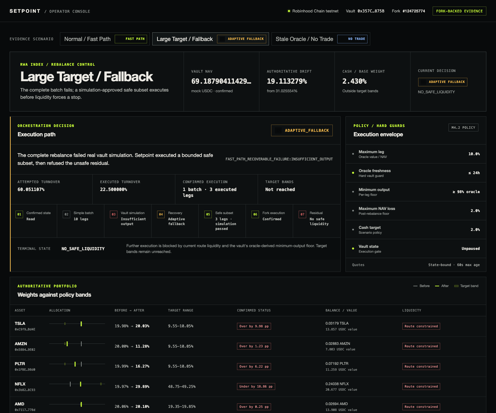

# Setpoint

Setpoint is a non-custodial safety and execution orchestration layer for onchain vault rebalances. It preflights simple rebalances and adapts only when liquidity or vault constraints make them unsafe.

The source of truth is [Setpoint PRD v1.2](./Setpoint_PRD_v1_2.md). Its hybrid execution decision is backed by the accepted [architecture decision](./docs/decisions/0001-hybrid-rebalance-orchestration.md); [PRD v1.1](./Setpoint_PRD_v1_1.pdf) is retained for history and the [v1.1 → v1.2 changelog](./Setpoint_PRD_v1_1_to_v1_2_CHANGELOG.md) summarizes the revision. This repository implements M0–M4.2 execution evidence and the M5 operator console for the RWA Index deployment on Robinhood Chain testnet. It does not contain a production execution service, CoW/0x adapters, custody, a DEX, cross-vault netting, or new vault accounting.

## M1 status

The harness:

1. starts a disposable Anvil fork of Robinhood Chain testnet (`chainId 46630`);
2. verifies the pinned external contracts and real role holders;
3. observes the deployed stale-oracle failure before changing state;
4. impersonates the existing authorized feeder on the fork and re-timestamps the existing prices;
5. calls the deployed testnet-only pool syncer as its real owner and checks all five real Synthra pools;
6. reads the vault's authoritative NAV, balances, targets, drift, and guard parameters;
7. constructs a small USDC-hub corrective `Trade[]` from the live over/underweights;
8. requires `rebalance(Trade[])` to pass `eth_call` from the real manager address;
9. executes the same call only on the disposable fork and verifies strict drift reduction and the NAV floor; and
10. writes the complete evidence record to `artifacts/rwa-index-m1-latest.json`.

The external source is included as the pinned git submodule `third_party/rwa-index` at commit `b2456ca5400ba9ec36d81691554b889fb9250513`.

## M2 status

The static baseline reproduces the upstream RWA Index-style policy without depth-aware optimization:

- value every delta with the vault oracle;
- split desired notional into legs no larger than the deployed 10%-NAV cap;
- emit every overweight sale to mock USDC before any underweight purchase;
- set `minAmountOut` to the vault's oracle output multiplied by its 98% floor;
- simulate the complete batch through the real `rebalance(Trade[])` interface; and
- after a successful fork transaction, discard the old plan and read authoritative state again.

The one-command runner covers relatively deep toy liquidity, thin toy liquidity, asymmetric liquidity, a large target change, a defensive cash target, and stale-oracle no-trade. It writes one JSON record per scenario under `artifacts/baseline/` and an aggregate `artifacts/baseline-summary.json`.

M2 is a control group only. It makes no claim that Setpoint outperforms this baseline.

## M3 status

Solver v1 is a reusable, chain-independent module under `src/core/`. It validates policy and confirmed portfolio inputs, classifies target ranges, generates one deterministic USDC-hub step, enforces balance and leg constraints, and returns either a simulation-approved `RebalancePlan` or a typed `NoTradeResult`.

The RWA adapter maps real vault state and guards into the core types. The runner executes at most one approved step, discards the plan, re-reads confirmed fork state, and solves again. It uses the exact M2 scenario definitions through one shared matrix module; M2 remains independently runnable.

M3 deliberately has no pool-depth input, quote-curve optimization, gas model, or liquidity-aware `INSUFFICIENT_OUTPUT` backoff. Those are M4 boundaries. Its artifacts record observed behavior but make no performance comparison with M2.

## M4 status

Solver v2 consumes reproducible executable-liquidity curves. The RWA sampler calls the deployed `SynthraSwapAdapter.swap()` path with `eth_call` from isolated Anvil snapshots; it does not mistake the adapter's advisory spot `quote()` for executable depth. Candidate sizes are bounded by target distance, vault caps, balances, cash policy, turnover policy, quote validity, and the oracle min-out floor.

The M4 comparison runner restores the baseline and Setpoint paths to the identical post-strategy fork state. Its common primary terminal criterion is all target bands satisfied; deployed 5% drift-trigger status is reported separately. Both paths may continue below that informational trigger during the comparison, without changing any deployed guard. The standalone M2 baseline remains unchanged.

Current toy-pool evidence is mixed and is not a marketing claim: the static baseline reaches the target bands in the moderate, asymmetric, and defensive scenarios; Solver v2 remains outside the bands at the common cycle cap or runs out of safe liquidity. For the large target change, static sizing executes nothing, while Solver v2 makes two safe steps before the NFLX quote curve has no size compatible with the vault's 98% oracle floor. See the versioned M4 artifacts for exact values.

## M4.1 status

The batch planner evaluates every materially relevant USDC-hub sell and buy in one confirmed state. It uses each sell's oracle-floor `minAmountOut`—not optimistic quote output—to fund later buys, preserves cash requirements, and ranks a bounded candidate set lexicographically by target-band drift, quote loss, turnover, safety margin, leg count, and stable ID. A failed `INSUFFICIENT_OUTPUT` backs off only the tightest sampled leg before rebuilding.

The final fork evidence is deliberately mixed. Deep and asymmetric scenarios now reach all target bands in three and two batches respectively, and defensive cash reaches them in one. Thin liquidity executes a five-leg safe subset but stops with the NFLX buy curve below the oracle floor. The large target case improves from 31.025554% to 19.113279% drift in one three-leg batch, then stops for the same real NFLX constraint. M2 remains faster in every normal scenario where it succeeds, and still has lower final drift in thin. These are testnet toy-pool observations, not production performance claims.

## M4.2 status

Setpoint now uses the simple coherent planner as its default fast path. It checks state, policy, exact-size executable quotes, conservative balances, configured hard limits, and the real vault simulation. A passing batch executes unchanged; adaptive planning is not invoked merely to seek a marginally cheaper route.

Only explicitly recoverable failures activate the existing M4.1 planner. On the final fork, deep, thin, asymmetric, and defensive scenarios all selected `FAST_PATH`, completed in one batch, and exactly matched M2's final states. The large-target fast path reproduced `INSUFFICIENT_OUTPUT`, automatically selected `ADAPTIVE_FALLBACK`, executed the same safe 22.5%-NAV subset as M4.1, then refused the unsafe residual NFLX route. Stale prices selected `NO_TRADE` without invoking fallback.

## M5 operator console

The M5 console is a thin React presentation layer over the accepted M4.2 artifacts. It presents the three core demo flows without reimplementing portfolio math, liquidity logic, simulation classification, or hybrid mode selection:

- normal rebalance → `FAST_PATH` → one confirmed batch → target bands reached;
- large target → `INSUFFICIENT_OUTPUT` → `ADAPTIVE_FALLBACK` → three-leg safe subset → residual `NO_SAFE_LIQUIDITY`; and
- stale oracle → `NO_TRADE` before simulation, fallback, or execution.



The console loads the versioned JSON in `artifacts/hybrid/` through one deterministic presentation adapter. Its “View raw evidence” and “Download JSON” actions serve those exact source artifacts. Every screen is labeled as historical, fork-backed Robinhood Chain testnet evidence; it does not imply production or live-fund execution.

Run it locally:

```bash
pnpm install --frozen-lockfile
pnpm dev
```

Open `http://localhost:5173`. Validate and preview the production bundle with:

```bash
pnpm typecheck
pnpm test
pnpm build
pnpm preview
```

## Reproduce

Prerequisites:

- Node.js 20 or newer
- Corepack/pnpm
- Foundry tools (`anvil` and `cast`)
- network access to the public Robinhood Chain testnet RPC

From a fresh clone:

```bash
git submodule update --init --recursive
corepack enable
pnpm install --frozen-lockfile
pnpm typecheck
pnpm test
pnpm m1:rwa-index
pnpm m2:baseline
pnpm m3:solver
pnpm m4:adaptive
pnpm m4:batch
pnpm m4:hybrid
pnpm build
```

No private key is needed. The command starts and cleans up Anvil itself. It uses fork-only account impersonation for the deployed oracle feeder/syncer owner and vault manager.

The source RPC can be overridden:

```bash
RWA_SOURCE_RPC_URL=https://your-rpc.example pnpm m1:rwa-index
```

An explicit fork block is also supported with `RWA_FORK_BLOCK_NUMBER`, but the public RPC is documented upstream as non-archival and may not serve older state.

## Repository layout

```text
config/rwa-index.json             chain, addresses, and pinned upstream revision
integrations/rwa-index/src/       ABI, state reader, candidate builder, fork harness
src/core/                         chain-independent policy, liquidity, Solver v1/v2
web/data/                         deterministic artifact-to-view-model adapter and tests
web/components/                   operator-console presentation components
web/App.tsx                       single-screen M5 console
scripts/m1-rwa-index.sh           disposable Anvil lifecycle and M1 entry point
scripts/m2-baseline.sh            scenario runner and static-baseline entry point
scripts/m3-solver.sh              scenario runner and Solver v1 entry point
scripts/m4-adaptive.sh            liquidity sampling and equivalent-state comparison
scripts/m4-batch.sh               multi-leg comparison on a fresh disposable fork
scripts/m4-hybrid.sh              simple fast path plus adaptive fallback benchmark
third_party/rwa-index/            pinned external project (git submodule)
artifacts/                        versioned latest JSON evidence; local Anvil logs ignored
docs/images/operator-console.png  captured M5 console screenshot
BUILD_LOG.md                      implementation record, assumptions, and blockers
```

## Accuracy and limitations

- The deployed base asset is an 18-decimal mintable mock USDC, not production USDC.
- The stock tokens and Synthra contracts are external Robinhood Chain testnet deployments; their pool liquidity is toy-sized and is not evidence of production liquidity.
- The oracle refresh deliberately preserves the deployed price values and updates only their timestamps on the fork. This proves stale-data recovery without claiming those old values are current market prices.
- Pool synchronization uses the external project's testnet-only syncer. Mainnet markets would require real price discovery/arbitrage rather than this helper.
- Every state-changing operation is confined to local Anvil. Setpoint does not custody or transfer live funds.
- The M5 console is a static view of versioned historical evidence. It neither starts Anvil nor submits transactions.
- M1 proves compatibility, M2 establishes the static control group, M3 proves deterministic simulation-gated planning, and M4 records the first equivalent-state liquidity-aware comparison. M4 does not support a blanket claim that Setpoint outperforms the baseline.

See [the integration notes](./integrations/rwa-index/README.md) and [BUILD_LOG.md](./BUILD_LOG.md) for exact behavior and the latest verified run.
