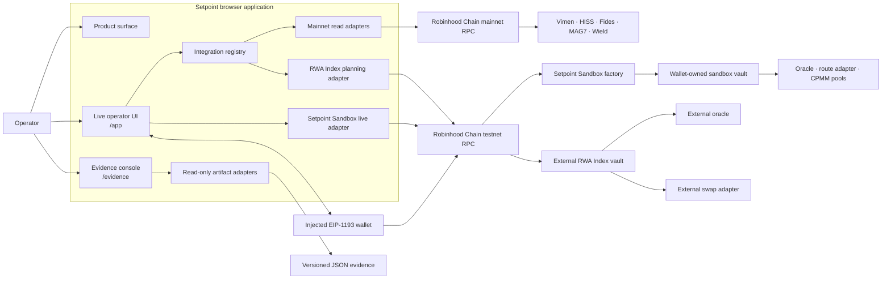
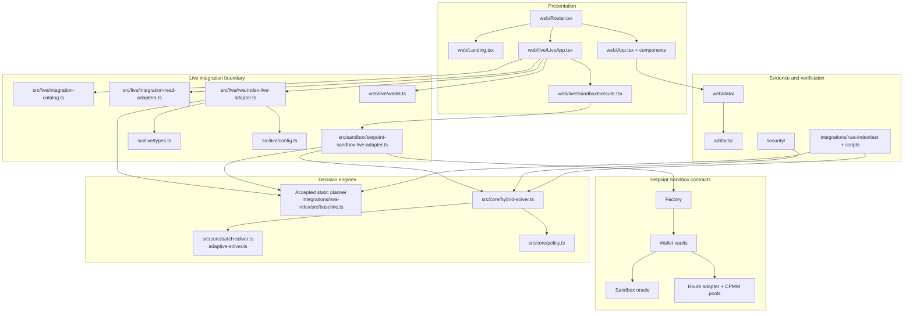
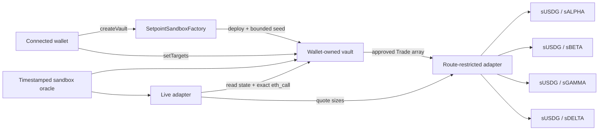
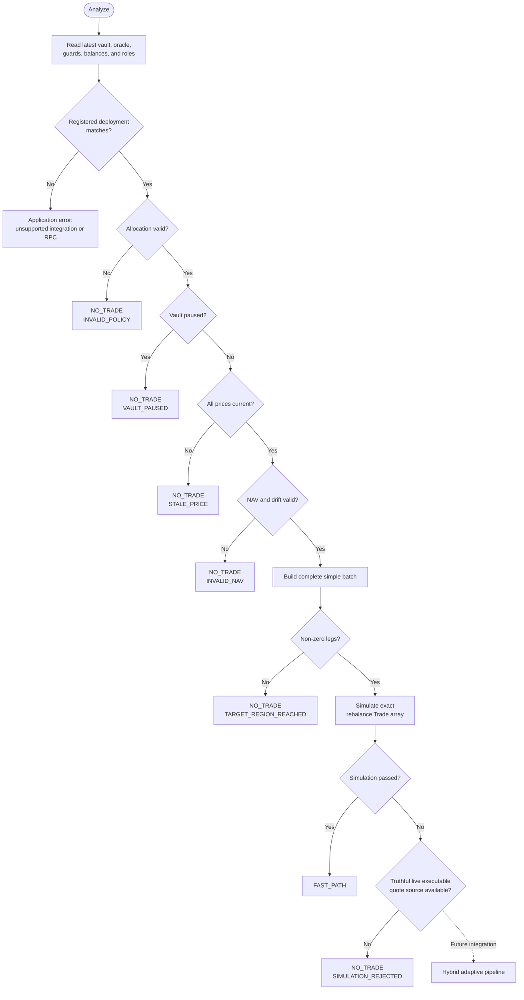
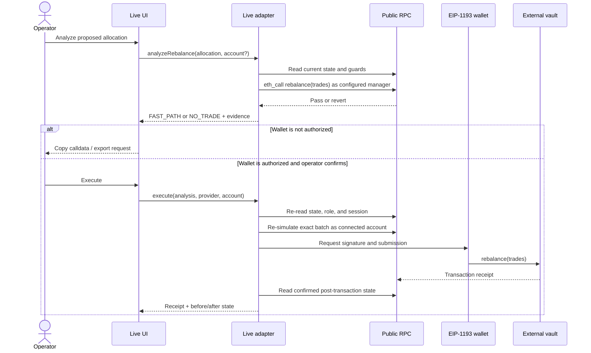

# Setpoint architecture

## 1. Purpose

Setpoint is a non-custodial decision and execution-safety layer for onchain vault rebalances. Its job is not to own the portfolio or invent authority. Its job is to turn current vault state plus a proposed target allocation into one of three explicit outcomes:

- `FAST_PATH`: the complete simple batch is safe enough to present for execution;
- `ADAPTIVE_FALLBACK`: an explicitly recoverable simple-batch failure was replaced by a smaller independently verified plan; or
- `NO_TRADE`: Setpoint cannot prove a safe execution path.

This document describes the current repository architecture, including a crucial implementation distinction:

- the **chain-independent hybrid core** contains all three decision modes and is demonstrated by deterministic and fork-backed evidence;
- the **Setpoint Sandbox live adapter** supplies current onchain pool quotes to that unchanged core, so its wallet-owned testnet path can select all three modes at runtime;
- the **RWA Index planning adapter** can return `FAST_PATH` or `NO_TRADE`, but deliberately cannot invoke adaptive fallback because the deployed venue exposes no trustworthy public executable-quote interface; and
- the **Vimen, HISS V2, Fides Frontier, MAG7, and Wield adapters** expose protocol-specific live state and Setpoint compatibility checks without fabricating targets, calldata, signer authority, or simulation support.

That distinction is a safety property, not a missing UI state.

## 2. Architectural principles

The system is organized around six invariants.

1. **Simple first.** If one coherent batch satisfies policy, liquidity preflight, and exact-vault simulation, Setpoint does not decompose it.
2. **Fail closed.** Missing, stale, unsupported, or unclassified evidence cannot produce execution.
3. **Simulation gates execution.** A plan is not executable merely because local math says it should work.
4. **State is disposable.** A plan belongs to the state from which it was derived. After a confirmed transition, Setpoint discards it and reads again.
5. **Authority stays onchain.** A sandbox vault is controlled only by its immutable wallet owner; external vaults retain their own roles and sessions. The UI cannot elevate a wallet.
6. **Evidence never impersonates live data.** Fork artifacts are useful proofs, but they are never inputs to `/app`.

## 3. System context

Setpoint is a browser-delivered static application plus a small testnet contract system. There is no Setpoint application API, database, relayer, or signing service. The browser exposes two fixed same-origin RPC pass-through routes (`/rpc/mainnet` and `/rpc/testnet`) because the upstream public RPC intermittently returns invalid duplicate CORS headers; these routes do not cache, interpret, or mutate JSON-RPC payloads.



The browser communicates with public chain infrastructure through those fixed transport rewrites. Local Node smoke tests call the same upstream RPC origins directly. Transaction signing remains inside the injected wallet. Historical JSON is bundled as static application data and has no route to the live adapter.

## 4. Runtime surfaces and boundaries

| Surface | Code owner | Input | Output | Explicitly cannot do |
|---|---|---|---|---|
| Landing | `web/Landing.tsx` | Static content | Product explanation and navigation | Read chain state or submit transactions |
| Live application | `web/live/` | Operator allocation and wallet events | Live state, typed analysis, calldata, execution status | Implement portfolio math or consume evidence artifacts |
| Sandbox contracts | `contracts/src/` | Wallet calls, testnet token balances, stored targets | Wallet-specific vault state and guarded real swaps | Access production funds, arbitrary routes, or offchain keys |
| Sandbox live adapter | `src/sandbox/` | Factory/vault/oracle/pool RPC state and optional provider | Current quote curves, hybrid decision, exact simulation, optional submission | Fabricate deployment state or bypass vault ownership |
| Integration registry | `src/live/integration-catalog.ts` | Registered address | Protocol identity, capability, source provenance, disclosure | Treat an arbitrary ERC-4626 vault as compatible |
| Mainnet read adapters | `src/live/integration-read-adapters.ts` | Protocol-specific RPC state | Normalized metrics, holdings, guards, and compatibility checks | Invent targets, calldata, authority, or execution support |
| RWA Index planning adapter | `src/live/rwa-index-live-adapter.ts` | RPC state, allocation, optional account/provider | Validated state, simulation result, optional submission | Claim adaptive liquidity without a live quote source |
| Decision core | `src/core/` | Normalized state, policy, prices, liquidity, simulator | `FAST_PATH`, `ADAPTIVE_FALLBACK`, or `NO_TRADE` with evidence | Read an RPC, sign, submit, or mutate a vault |
| Evidence presentation | `web/data/`, `web/components/` | Checked-in JSON artifacts | Read-only scenario view models | Import execution solvers or submit transactions |
| Integration harness | `integrations/rwa-index/` | External ABI/source and fork state | Static plans, quotes, fork execution evidence | Represent fork observations as live state |

The separation is enforced structurally and tested. Protocol adapters own live reads and semantics; React selects an adapter and presents normalized results. `SetpointSandboxLiveAdapter` owns the primary Setpoint execution workflow, while `RWAIndexLiveAdapter` preserves its narrower external workflow. The evidence console maps artifacts into view models without importing the execution core.

## 5. Component architecture



### Why the RWA Index planning adapter does not call the hybrid core

The accepted hybrid core requires executable-liquidity curves bound to current state. The current Synthra deployment does not expose a verified public quote method that can provide those curves without fork-only state mutation. Calling the hybrid core with historical curves would make the result look live while depending on old evidence.

The live adapter therefore reuses only the accepted static planner, performs an exact `eth_call`, and returns `NO_TRADE / SIMULATION_REJECTED` if that batch fails. Its result type exposes `adaptiveFallbackAvailable: false` so this boundary is machine-visible as well as documented.

The Setpoint Sandbox has the missing evidence source: every supported asset has a registered constant-product pool and the adapter exposes a deterministic `quote()` against current real reserves. Its live adapter samples multiple sizes in both directions, includes each exact simple-plan size, binds samples to the current state ID/block, and passes those curves to the existing `solveHybrid()` implementation. No solver fork or React-side planner exists.

## 6. Setpoint Sandbox onchain architecture

The sandbox exists to make the primary user action executable without pretending an external protocol granted public authority.



| Contract | State/authority | Guardrail |
|---|---|---|
| `SetpointSandboxFactory` | `getVault[wallet]`; one deployment per wallet | Rejects duplicates; seeds only the documented 10,000 sUSDG test allocation |
| `SetpointSandboxVault` | Immutable owner, balances, targets, guard parameters | Owner-only targets/rebalance; allowlisted routes; 2% drift trigger; 30% NAV leg cap; 3% oracle slippage floor; fresh prices; strict drift improvement; 2% NAV-loss cap |
| `SetpointSandboxOracle` | WAD price, `updatedAt`, owner/updater | Zero prices and unauthorized updates revert; vault enforces a 24-hour maximum age |
| `SetpointSandboxPool` | Real ERC-20 reserves and 30 bps fee | Constant-product quote/swap; only the configured route adapter may execute |
| `SetpointSandboxSwapAdapter` | Asset-to-pool allowlist | Only direct sUSDG/risk routes; no arbitrary target/calldata surface |
| `SetpointSandboxToken` | Testnet-only balances and factory mint authority | No production claim; mint authority is transferred to the factory after pool seeding |

The initial portfolio is intentionally actionable: 55% cash plus 25/10/7/3% risk value against a 20/20/20/20/20 target. It is large enough to demonstrate planning but bounded, deterministic, and isolated from production value.

### Sandbox runtime sequence

```mermaid
sequenceDiagram
    actor O as Wallet owner
    participant UI as Sandbox UI
    participant A as Sandbox live adapter
    participant C as Hybrid core
    participant RPC as Testnet RPC
    participant V as Owner vault

    O->>UI: Analyze rebalance
    UI->>A: analyze(owner)
    A->>RPC: Read factory, vault, prices, balances, targets, pools
    A->>RPC: Quote both directions at bounded sizes
    A->>C: solveHybrid(state, policy, curves, simulator)
    C->>RPC: Exact eth_call through injected simulator
    C-->>UI: FAST_PATH / ADAPTIVE_FALLBACK / NO_TRADE
    O->>UI: Execute approved plan
    UI->>A: execute(analysis, provider, owner)
    A->>RPC: Re-read relevant-state ID + exact owner eth_call
    A->>O: Request wallet signature
    O->>V: rebalance(Trade[])
    V-->>A: Confirmed receipt
    A->>RPC: Re-read confirmed post-state
    A-->>UI: Hash, block, before/after; discard plan
```

The checked deployment file is the source of browser configuration. The current record is `DEPLOYED` on chain `46630` from block `125344949`; the browser therefore resolves only the recorded factory, oracle, route adapter, tokens, and pools. If that record is absent or explicitly reset to `UNDEPLOYED`, the execution UI returns to the broadcast gate and sandbox RPC methods refuse to proceed.

## 7. Live integration registry

The registry is an allowlist of exact chain/address pairs, not ERC-4626 interface detection. Each entry records its network, capability level, external source repository, pinned source commit, and execution boundary.

| Integration | Native model | Setpoint capability | Current execution boundary |
|---|---|---|---|
| Vimen Agentic MAG7 | Funded mutable seven-stock recipe with immutable asset-registry, maker, cooldown, turnover, slippage, and full-backing guards | Live balances, backing units, feed ages, policy, full-backing result, and oracle-gated NAV reads | Read-only; the agent key and a registered maker own execution |
| HISS Vault V2 | Queue-routed USDG vault with keeper, liveness, capacity, and held-asset surfaces | Live accounting, portfolio, queue, guard, and compatibility reads | Read-only; keeper/rebalance lane is protocol-controlled and currently inactive by policy |
| Fides Frontier | Unit-backed immutable basket with constrained rebalancer | Live balances, backing units, oracle ages, full-backing result, and guard reads | Read-only; external rebalancer and route construction are required |
| MAG7 Index Vault | Equal-weight seven-stock index with vault-native NAV, freshness, drift band, notional cap, and leg cooldown | Live deployment, inventory, accounting, feed and bounded-rebalance policy reads | Read-only and secondary while the deployment has zero issued supply and inventory |
| Wield RWA Vault | ERC-4626 USDG vault with agent-signed allocation intents | Live registry, balances, oracle metadata, nonce, signer, and guard reads | Read-only; a valid `agentDid` signature is required |
| RWA Index | Target-weight vault with `rebalance(Trade[])` | Allocation validation, simple planning, exact simulation, export, and authorized submission | No adaptive live fallback without executable quote evidence |

The five mainnet adapters produce a `LiveIntegrationSnapshot`: block provenance, readiness (`READY`, `DEGRADED`, or `EMPTY`), metrics, holdings, guards, compatibility checks, and a human-readable execution boundary. `READY` means the declared read surface is healthy; it does not silently upgrade a read adapter into a transaction adapter.

The catalog UI reads all six deployments concurrently. Vimen, HISS, Fides, and RWA Index occupy the primary grid; the currently empty MAG7 and Wield deployments remain in a visible secondary watchlist. A failed RPC read is shown as unavailable rather than replaced with cached values. Selecting a mainnet integration opens a live compatibility workspace. Selecting RWA Index enters the planning pipeline below.

## 8. RWA Index live decision pipeline

The live pipeline is intentionally narrower than the full hybrid engine.



### State acquisition

`readVaultState()` validates the requested vault against the registered deployment, then reads:

- chain ID, latest block number/hash/timestamp;
- vault assets, base asset, oracle, and swap-adapter addresses;
- balances, token metadata, target weights, and oracle observations;
- vault pause, drift, trade-size, slippage, staleness, and loss guards; and
- `MANAGER_ROLE` plus active agent-session authorization for an optional account.

Integration addresses are checked against `src/live/config.ts`. Assets are currently required to use the verified deployment's 18-decimal representation.

Each live adapter resolves the latest block first and pins subsequent accounting, policy, oracle, bytecode, balance, and reserve reads to that explicit block identity. The sandbox uses its EIP-1898 block hash because the Robinhood public testnet RPC rejects number-pinned `eth_call`; external adapters use block numbers where supported. This gives the displayed block real snapshot meaning. A fresh state read and account-specific exact simulation are still mandatory immediately before a transaction because state can change after any snapshot and before mining.

### Accounting under stale prices

The oracle is authoritative for this integration. When any observation exceeds `maxStaleness`, Setpoint still exposes raw balances, targets, timestamps, and guards, but sets NAV, asset values, weights, and drift to unavailable. It does not silently calculate a substitute NAV from stale inputs.

### Allocation validation

The live adapter requires:

- one proposed weight for every configured asset;
- no unregistered asset key;
- no negative weight;
- at most 80% for each non-cash asset; and
- exactly 100% across cash and assets.

The edited proposal is analysis input. It does not mutate the vault's stored target configuration. The browser stores a valid proposal in local storage for operator convenience; it does not store signing keys or execution authority.

### Batch construction and simulation

The static planner constructs the RWA Index-style batch under the vault's `maxTradeFraction` and `slippageTolerance`. Calldata is encoded for the exact external `rebalance(Trade[])` ABI. Analysis simulation uses the configured manager identity so that authorization noise does not hide whether the plan itself would pass the vault.

This simulation is evidence for a decision, not authority to execute. The connected wallet is checked independently.

## 9. Full hybrid decision core

The chain-independent core accepts normalized state and injected adapters rather than importing chain clients. Its main contracts are:

| Contract | Role |
|---|---|
| `PortfolioState` | State ID, block provenance, NAV, cash, drift, and positions |
| `VaultPolicy` | Target bands, drift trigger, trade/loss/age limits, and pause state |
| `PricePoint` | WAD price, update time, and source |
| `Trade` | `tokenIn`, `tokenOut`, `amountIn`, and `minAmountOut` |
| `SimulationAdapter` | Injected exact-execution gate for a candidate batch |
| `RebalancePlan` | Accepted plan plus expected effects, constraints, simulation, and rejected alternatives |
| `NoTradeResult` | Typed refusal with reason and supporting details |

`solveHybrid()` follows this order:

1. validate policy, state, prices, and routes;
2. stop if the target region is already reached or drift is below its trigger;
3. preflight the simple batch against order, balance, leg-size, min-out, turnover, cash, loss, and quote constraints;
4. simulate the exact simple batch;
5. return `FAST_PATH` if both preflight and simulation pass;
6. invoke adaptive planning only if every blocking condition is recoverable;
7. independently simulate the adaptive candidate; and
8. return `ADAPTIVE_FALLBACK` or typed `NO_TRADE` with rejected alternatives and excluded legs.

The recoverable simulation failures are intentionally closed over a small allowlist:

- `INSUFFICIENT_OUTPUT`
- `TRADE_TOO_LARGE`
- `INSUFFICIENT_BALANCE`
- `DRIFT_NOT_IMPROVED`
- `EXCESSIVE_VALUE_LOSS`

Stale inputs, invalid policy, unsupported routes/assets, loose min-out construction, authorization failures, and unknown reverts cannot activate fallback.

### Liquidity evidence

Adaptive decisions require state-bound quote samples, not nominal pool balances. A sample records the exact direction and size, expected output, oracle output, price impact, quote loss, compatibility with `minAmountOut`, source state, and age. The planner records the selected sample and binding constraint for every accepted leg and preserves excluded or rejected alternatives.

That evidence model is why the solver can explain not only what it selected, but also why apparently useful residual trades were refused.

## 10. External RWA Index transaction lifecycle

This sequence describes the RWA Index planning adapter. Mainnet compatibility adapters terminate at a read-only snapshot and never enter this lifecycle. Analysis and execution are separate state transitions. An analysis can be exported without a wallet; execution requires current external authority.



The execution method accepts only a simulation-approved `FAST_PATH` result with calldata. It then:

1. reads current vault state with the connected account;
2. verifies manager-role or active-session authority;
3. re-simulates the same trades as that account;
4. asks the wallet to submit;
5. waits for the receipt; and
6. reads post-confirmation state.

There is still an unavoidable interval between simulation and mining. The external vault's hard guards remain the final protection if state changes in that interval.

## 11. Authority and custody boundary

| Capability | Setpoint | External vault / wallet |
|---|---:|---:|
| Read public state | Yes | Provides state |
| Propose an allocation for analysis | Yes | No mutation implied |
| Build and simulate calldata | Yes for sandbox; capability-dependent externally | Vault code determines success |
| Hold portfolio assets | No in the browser; sandbox vault contracts hold test assets | Vault contract |
| Grant authority | Factory binds sandbox ownership; no role elevation | Wallet owner or external vault administration |
| Hold or export a private key | No | Wallet |
| Approve a signature | No | Operator in wallet |
| Enforce final onchain guards | No | Vault |

The sandbox contracts participate directly and are therefore deliberately small. They do not proxy external vaults, hold production capital, accept arbitrary calls, or create a hidden signer. External integrations remain outside this contract system.

## 12. Error and decision taxonomy

Setpoint keeps product decisions distinct from infrastructure and user-interaction errors.

| Category | Examples | Meaning |
|---|---|---|
| Decision | `STALE_PRICE`, `INVALID_POLICY`, `SIMULATION_REJECTED` | Analysis completed and deliberately returned `NO_TRADE` |
| RPC/application | RPC unavailable, chain mismatch, unsupported vault | The system could not complete a valid analysis |
| Wallet | disconnected provider, rejected signature, failed network switch | The operator or wallet stopped the workflow |
| Transaction | submitted call reverted or receipt failed | Execution failed after the analysis boundary |

Collapsing these into `NO_TRADE` would make safety decisions indistinguishable from outages, so the UI preserves them as different states.

## 13. Evidence architecture and provenance

The evidence plane is immutable at runtime:

```text
fork/test runner
    -> versioned JSON artifacts
    -> web/data adapters
    -> read-only evidence view models
    -> /evidence
```

Artifacts record scenario metadata, fork source block, before/after portfolio state, selected and excluded legs, simulation results, turnover, drift, and terminal reason. The UI never treats fork transaction hashes as public-chain transactions.

Evidence levels are explicit:

- **live RPC:** current external reads shown in `/app`;
- **fork evidence:** real contract behavior against a disposable fork;
- **integration-test evidence:** deterministic fixtures exercising policy and failure boundaries; and
- **static presentation:** rendering of already accepted artifacts.

The security generator also records source hashes, including the frozen M2 planner hash, so a regenerated proof fails if a protected implementation changes unexpectedly.

## 14. Deployment architecture

The production build is a Vite static bundle deployed on Vercel.

- `web/Router.tsx` selects `/`, `/app`, or `/evidence` in the browser.
- Vercel rewrites application routes to `index.html`.
- Live and evidence bundles are lazy-loaded as separate route surfaces.
- The Content Security Policy permits network connections only to the application origin and the official Robinhood Chain mainnet and testnet RPC endpoints.
- Framing, objects, camera, microphone, geolocation, and payment APIs are disabled by response headers.
- There is no server-side signing credential. Contract deployment and oracle refresh are explicit operator commands that read a local environment key; the browser bundle never receives it.

Because `/app` is client-side, its RPC URL and registered contract addresses are public configuration, not secrets.

## 15. Verification strategy

| Layer | Primary command | What it establishes |
|---|---|---|
| Type contracts | `pnpm typecheck` | Node and web TypeScript boundaries compile |
| Unit/integration | `pnpm test` | Solver behavior, live adapter behavior, data adapters, and security invariants |
| Product build | `pnpm build` | The browser application compiles and bundles |
| Evidence UI | `pnpm demo:check` | Accepted artifact flows remain renderable and internally consistent |
| Security cases | `pnpm security:demo` | Five scenarios and 11 fail-closed invariants regenerate deterministically |
| Integration registry | `pnpm integrations:smoke` | All six addresses resolve to bytecode and their declared live read surfaces remain callable |
| External read path | `pnpm live:smoke` | Current chain, bytecode, addresses, guards, oracle reads, and `eth_call` capability |
| Sandbox contracts | `pnpm sandbox:contracts` | Factory seed ceiling, ownership, targets, immutable oracle/refresh behavior, stale-price refusal, real swaps, shared-pool availability, product invariant, and fuzzed quotes |
| Sandbox deployment | `pnpm sandbox:smoke` | Recorded bytecode, topology, global budget, worst-case reserve quotes, routes, and immutable oracle state on chain 46630 |
| Fork milestones | `pnpm m1:rwa-index` through `pnpm m4:hybrid` | Historical compatibility and planning evidence |

`integrations:smoke` and `live:smoke` depend on external networks and mutable contract state. A `DEGRADED` or `EMPTY` integration is a successful truthful observation; missing bytecode, invalid provenance, or an unreadable required surface fails the smoke test.

## 16. Adding another live integration

A new integration should be a new adapter, not a conditional expansion of React portfolio logic. At minimum it must define and prove:

1. **Identity:** chain ID, supported vault addresses, ABI, base asset, oracle, and execution venue.
2. **Authoritative reads:** balances, targets, accounting values, timestamps, guards, and block provenance.
3. **Normalization:** token decimals, WAD conversions, supported assets, and route rules.
4. **Policy validation:** complete target semantics and integration-specific limits.
5. **Planning:** a deterministic simple-batch constructor with visible unsupported legs.
6. **Simulation:** the exact target-vault call with an identity that separates plan validity from user authorization.
7. **Authorization:** the vault-native role/session checks required for submission.
8. **Execution:** account-specific re-simulation, wallet submission, receipt handling, and confirmed-state re-read.
9. **Liquidity proof:** if adaptive mode is exposed, current executable quotes bound to the same state and exact trade sizes.
10. **Failure mapping:** typed decision reasons kept separate from RPC, wallet, and transaction errors.
11. **Tests and evidence:** normal, stale, invalid, unsupported, recoverable, unknown-revert, and state-transition cases.
12. **Security review:** updated trust assumptions, CSP endpoints, and threat analysis.

An integration is not adaptive-capable merely because a pool has reserves or a quote can be estimated locally. It must provide evidence that matches the actual route, direction, size, state, and execution constraints.

## 17. Known limitations and non-goals

The current system deliberately does not provide:

- Setpoint-managed production funds or a production execution integration (the owned path is explicitly a testnet sandbox);
- custody, key management, role administration, or transaction relaying;
- a private RPC, indexer, backend database, or atomic archival read service;
- live adaptive fallback for the external Synthra deployment (the sandbox path does supply adaptive quote evidence);
- cross-venue routing, cross-vault netting, or MEV protection;
- protection from a malicious-but-fresh oracle, compromised RPC, compromised wallet, or bugs in external contracts;
- proof-of-personhood or per-user liquidity isolation in the public sandbox factory; shared-pool impact is instead bounded by a 32-vault / 320,000 sUSDG global seed ceiling and deep pools;
- guaranteed oracle liveness if both the six-hour automation and all permissionless callers stop; the unchanged 24-hour guard then fails closed; or
- an audit or formal-verification claim.

The mainnet integrations are read-only compatibility surfaces. The testnet planning integration uses mock assets and toy venue liquidity. These constraints are visible in the product because hiding them would weaken the meaning of every decision the product returns.

## 18. Related decisions

- [Decision 0001: Hybrid rebalance orchestration](./decisions/0001-hybrid-rebalance-orchestration.md)
- [Decision 0002: Live product and evidence boundary](./decisions/0002-live-product-boundary.md)
- [Decision 0003: Wallet-owned testnet sandbox](./decisions/0003-wallet-owned-testnet-sandbox.md)
- [Security model and failure evidence](./SECURITY.md)
- [Repository overview](../README.md)
